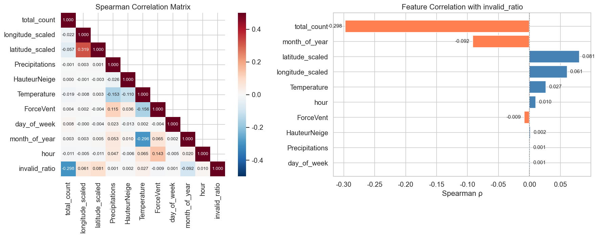
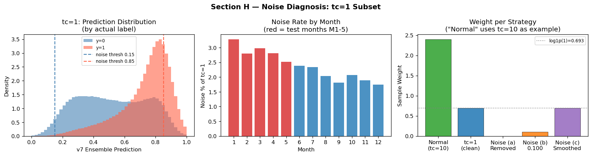
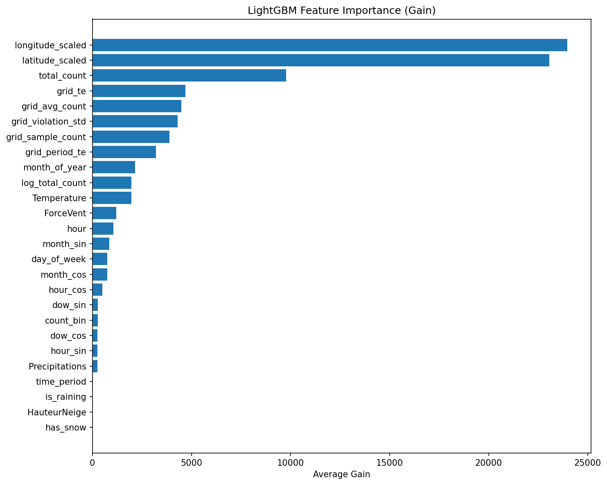
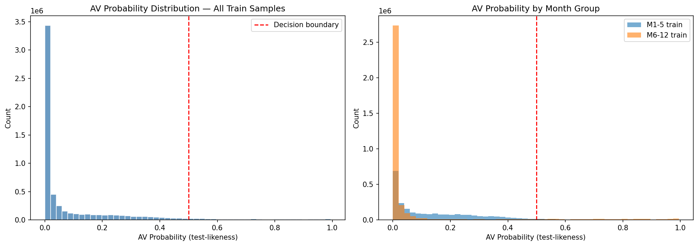
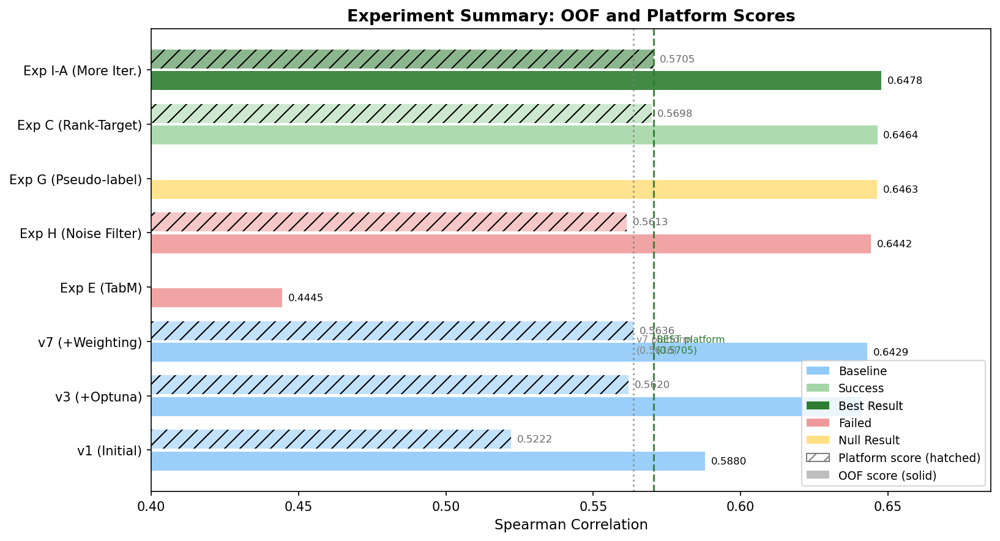
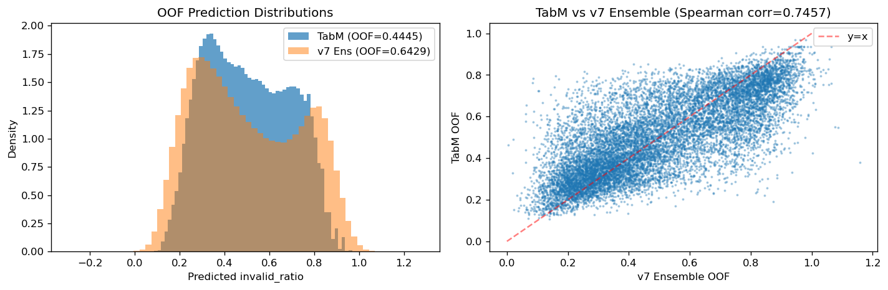

<!-- ───────────────────────────── SLIDE 1: COVER ───────────────────────────── -->
---
layout: cover
coverDate: 'April 2026'
coverBackgroundUrl: ../docs/figures/fig5_spatial_violation.png
---

# Predicting Parking Violation Rates
## Using Gradient Boosting

<br>

**ChallengeData #163** · CS5483 Data Mining

<br>

<div class="text-xl font-bold text-yellow-300">Platform Spearman: 0.5705 · Rank #5 Globally</div>

<!--
Open with the real-world context: a smart parking enforcement system in Thessaloniki, Greece.
The heatmap behind us shows actual violation patterns across the city — darker means more violations.
-->

<!-- ─────────────────── SECTION DIVIDER ─────────────────── -->
---
layout: section
---

# Section 1
## Introduction & Problem Setup

<!-- ───────────────────────────── SLIDE 2: PROBLEM & DATA ───────────────────────────── -->
---
layout: two-cols
---

# What Are We Predicting?

- **Dataset**: THESi smart parking system, Thessaloniki, Greece
- **Training set**: 6.07 million observations, 10 features
- **Target**: `invalid_ratio` — fraction of invalid parking events per location-timeslot
- **Evaluation**: Spearman rank correlation ρ

<br>

| Split | Rows |
|-------|------|
| Train | ~6.07 M |
| Test  | ~1.5 M |
| Features | 10 |

<br>

> **The metric rewards ranking — not numerical accuracy.**

::right::


<small class="text-gray-400 text-xs">Distribution of `invalid_ratio` — highly skewed, mass at 0 and 1</small>

<!--
Note the bimodal mass at 0 and 1 — this is caused by low-count locations
where only one parking event was recorded, forcing the ratio to be binary.
This noise problem becomes critical later.
-->

<!-- ───────────────────────────── SLIDE 3: WHY SPEARMAN ───────────────────────────── -->
---
layout: two-cols
---

# Understanding the Evaluation Metric

- **Spearman ρ** measures rank agreement between predictions and ground truth
- Only the **relative ordering** matters — not absolute values
- A perfect ranking achieves ρ = 1.0 regardless of scale

<br>

| | Objective | Cares About |
|--|-----------|-------------|
| ❌ MSE loss | Minimize squared error | Absolute values |
| ✅ Spearman ρ | Preserve rank order | Relative ordering |

<br>

- Official baseline (Random Forest, 10 trees): ρ = **0.197**
- **Our final result: ρ = 0.5705 · Rank #5 globally**

<br>

> *"Getting the order right matters more than getting the number right."*

::right::


<small class="text-gray-400 text-xs">Leaderboard — our submission at Rank #5 with Platform Spearman 0.5705</small>

<!--
This metric insight motivates our key innovation later: rank-target training.
If we train to minimize MSE but evaluate with Spearman, we're optimizing the wrong objective.
-->

<!-- ─────────────────── SECTION DIVIDER ─────────────────── -->
---
layout: section
---

# Section 2
## Data Exploration & Feature Engineering

<!-- ───────────────────────────── SLIDE 4: EDA FINDINGS ───────────────────────────── -->
---
layout: two-cols-header
---

# What the Data Tells Us

::left::

- **Strongest predictor**: `total_count` (ρ = −0.297) — busier locations have fewer violations
- Geographic patterns (longitude, latitude) carry strong spatial signal
- Temporal features (hour, month) show clear enforcement cycles
- Weather features: minimal predictive power (ρ < 0.03)


::right::



<small class="text-gray-400 text-xs">Spearman correlations — total_count and location dominate</small>

<!--
Most signal comes from where you are and how busy it is.
Weather and time are much weaker predictors.
-->

<!-- ───────────────────────────── SLIDE 5: NOISE PROBLEM ───────────────────────────── -->
---
layout: two-cols
---

# Challenge: High Noise in Low-Count Observations

- Locations with `total_count = 1` account for **~25% of training data**
- For these, `invalid_ratio` is exactly 0 or exactly 1 — binary, not continuous
- Creates severe **label noise** that degrades model training

<br>

**Solution: Sample Weighting**

```python
sample_weight = np.log1p(total_count)
```

- Downweights noisy tc=1 samples without discarding them
- Preserves the full 6M training set
- Applied consistently from v7 onwards

<br>

> *"Down-weight unreliable samples, don't throw them away."*

::right::



<small class="text-gray-400 text-xs">Label noise diagnosis — tc=1 subset shows extreme bimodality</small>

<!--
This was diagnosed early in EDA. The fix is simple but important:
log1p(total_count) gives weight proportional to how reliable the label is.
-->

<!-- ───────────────────────────── SLIDE 6: FEATURE ENGINEERING ───────────────────────────── -->
---
layout: two-cols
---

# Tier 2 Feature Engineering Pipeline

<v-clicks>

1. **Spatial binning**: Divide map into grids → `grid_x`, `grid_y`, `grid_id`
2. **K-Fold Target Encoding** (k=5): `grid_te`, `period_te`, … → captures violation rates per zone without leakage
3. **Cyclic encoding**: `sin/cos(hour)`, `sin/cos(month)` → preserves periodicity
4. **Cross features**: `total_count × grid_te` → captures interaction between busyness and location risk
5. **Result**: ~20 engineered features from 10 originals

</v-clicks>

<br>

<v-click>

> **K-Fold TE prevents data leakage — a critical design choice.**
> Training TE is computed within-fold; test TE uses the full training set.

</v-click>

::right::


<!--
The most important step here is the K-Fold target encoding.
Using full-train TE without folds would cause target leakage and overestimate OOF scores.
-->

<!-- ───────────────────────────── SLIDE 7: FEATURE IMPORTANCE ───────────────────────────── -->
---
layout: two-cols
---

# What Drives Violation Rates?

- `total_count` and `grid_te` are consistently the **top-2 features**
- Geographic (TE) features dominate over weather and raw coordinates
- SHAP: high `total_count` → **lower violation rate** (busy = compliant)
- Weather features (precipitation, temperature): minimal SHAP contribution

<br>



::right::


<!--
The SHAP dependence plot shows: as total_count increases, SHAP values become more negative,
meaning the model predicts lower violation rates. This aligns with intuition —
busy parking zones attract compliant behavior or more enforcement.
-->

<!-- ─────────────────── SECTION DIVIDER ─────────────────── -->
---
layout: section
---

# Section 3
## Baseline Development & Gap Analysis

<!-- ───────────────────────────── SLIDE 8: MODEL ARCHITECTURE ───────────────────────────── -->
---
layout: two-cols
---

# Model: LightGBM + XGBoost Ensemble

- **Base models**: LightGBM and XGBoost (gradient boosting decision trees)
- **Ensemble**: weighted average, weights optimized on OOF Spearman
- CatBoost was tested — final weight converged to **0**, excluded
- **Cross-validation**: 5-Fold with Spearman early stopping

<br>

| Model | OOF ρ |
|-------|-------|
| LightGBM alone | ~0.630 |
| XGBoost alone | ~0.618 |
| LGB + XGB ensemble | **0.6429** |
| + CatBoost (weight→0) | no gain |

<br>

> Two-model ensemble outperformed the three-model one.

::right::


<!--
The ensemble gain comes from diversity between LGB and XGB in their tree construction methods.
CatBoost adds no diversity — its learned representation overlaps with LGB.
-->

<!-- ───────────────────────────── SLIDE 9: BASELINE PROGRESSION ───────────────────────────── -->
---
layout: two-cols
---

# Iterative Improvement: v1 → v7

| Version | Key Change | Platform ρ | Δ |
|---------|------------|------------|---|
| v1 | Initial LGB + XGB | 0.5222 | — |
| v2 | Increased n_estimators | 0.5338 | +0.0116 |
| v3 | Optuna hyperparameter tuning | 0.5620 | +0.0282 |
| v7 | Sample weighting `log1p(tc)` | **0.5636** | +0.0016 |

<br>

- **Optuna** (v3) was the biggest pre-innovation gain: +0.0282
- Each decision was documented and version-controlled
- OOF ≈ 0.643, Platform ≈ 0.564 — consistent ~0.079 gap

<br>

> Each engineering decision produced **measurable, documented improvement.**

::right::


<small class="text-gray-400 text-xs">Score journey — solid line = OOF, dashed = Platform</small>

<!--
Notice the gap between OOF and Platform scores is consistent across versions.
This stability tells us the gap is systematic — not overfitting.
We investigated this next.
-->

<!-- ───────────────────────────── SLIDE 10: GAP DIAGNOSIS ───────────────────────────── -->
---
layout: two-cols
---

# Why Is There a Gap Between OOF and Platform?

**Observed**: OOF ~0.643, Platform ~0.564 → gap **~0.079**

<br>

| Hypothesis | Test | Result |
|-----------|------|--------|
| Overfitting | Stronger regularization | ❌ Scores got worse |
| **Distribution shift** | Adversarial validation | ✅ Train/test AUC = 0.9999 |
| | Temporal CV (M1–M4 → M5) | ✅ Gap −0.041 |
| | TE distribution plot | ✅ Clear mismatch |

<br>

> *"We diagnosed the gap before trying to fix it."*

The train and test sets come from **different temporal periods** — distribution shift is unavoidable. Our strategy: focus on **maximizing OOF**, which tracks Platform reliably.

::right::




<small class="text-gray-400 text-xs">Top: AV near-perfect separation. Bottom: stable ~0.077 gap across all versions.</small>

<!--
The adversarial validation result is striking: AUC = 0.9999 means the model
can almost perfectly distinguish train from test samples.
This proves the gap is structural distribution shift, not overfitting.
-->

<!-- ─────────────────── SECTION DIVIDER ─────────────────── -->
---
layout: section
---

# Section 4
## Key Innovation: Rank-Target Training

<!-- ───────────────────────────── SLIDE 11: MISALIGNED OBJECTIVE ───────────────────────────── -->
---
layout: statement
---

# Training with MSE ≠ Optimizing Spearman

MSE penalizes large **numerical** deviations.  
Spearman only cares about **relative order**.

*Training in the wrong direction.*

<!--
This is the core insight. Our model was trained to minimize MSE
but evaluated on Spearman. These are fundamentally different objectives.
The natural fix: make the training objective match the evaluation metric.
-->

<!-- ───────────────────────────── SLIDE 12: RANK-TARGET TRANSFORM ───────────────────────────── -->
---
layout: two-cols
---

# Solution: Train to Rank, Not to Regress

**Transformation:**

$$y_{\text{rank}} = \frac{\text{rankdata}(y)}{N}$$

- Converts the target to a **uniform [0, 1] distribution** of ranks
- The model now learns **relative ordering**, not absolute values
- At inference: predictions are re-ranked → Spearman is computed on ranks

<br>

```python {1-2|3-5|all}
# Replace raw target with rank-normalized target
y_rank = rankdata(train_df['invalid_ratio']) / len(train_df)

# Train exactly as before — no other changes
lgb_model.fit(X_train, y_rank, ...)
```

<br>

> *"One line of code. The biggest single improvement in our entire pipeline."*

::right::


<small class="text-gray-400 text-xs">Left: skewed original target. Right: uniform rank-transformed target.</small>

<!--
The beauty of this approach is its simplicity.
By replacing the target with its rank percentile, we directly align
what the model optimizes with what Spearman measures.
-->

<!-- ───────────────────────────── SLIDE 13: RANK-TARGET RESULTS ───────────────────────────── -->
---
layout: two-cols
---

# Impact: Rank-Target Delivers Our Largest Gain

| | OOF ρ | Platform ρ | Δ Platform |
|--|-------|------------|------------|
| v7 (baseline) | 0.6429 | 0.5636 | — |
| Exp C (rank-target) | 0.6464 | 0.5698 | **+0.0062** |
| Exp I-A (+iterations) | **0.6478** | **0.5705** | **+0.0069** |

<br>

- Exp I: Increased LGB iterations 10K → 20K → additional **+0.0007** Platform
- Final: **Platform 0.5705, Rank #5 globally**

<br>

> Metric alignment gave us the **biggest single-step improvement** of the entire project.

::right::


<small class="text-gray-400 text-xs">Full journey: v1 (0.5222) → Exp I-A (0.5705)</small>

<!--
Exp C alone gave us +0.0062 Platform, which is more than any individual
feature engineering step. This confirms the hypothesis: the training objective matters.
Exp I-A squeezed out another +0.0007 by giving the rank-trained model more iterations.
-->

<!-- ─────────────────── SECTION DIVIDER ─────────────────── -->
---
layout: section
---

# Section 5
## Experiment Summary & Analysis

<!-- ───────────────────────────── SLIDE 14: ALL EXPERIMENTS ───────────────────────────── -->
---
layout: default
---

# 9 Experiments: What Worked and What Did Not



<div class="text-xs text-gray-400 text-center mt-1">OOF (solid bars) and Platform (hatched bars) scores · green = success · red = failed · yellow = null result</div>

<!--
Key takeaways from this chart:
- Rank-target (Exp C, I-A) is the clear winner
- Strong regularization confirmed gap is NOT overfitting
- TabM deep learning is far behind GBDT
- Noise removal (Exp H) improved OOF but hurt Platform — distribution shift
- Pseudo-labeling (Exp G) had zero effect
-->

<!-- ───────────────────────────── SLIDE 15: DL FAILURE ───────────────────────────── -->
---
layout: two-cols
---

# Deep Learning Does Not Help Here

- Tested **TabM** (ICLR 2025 — state-of-the-art tabular deep learning)
- OOF Spearman: **0.4445** vs GBDT **0.6429** — gap of **0.198**
- Root cause: only 10 input features, no image/text structure
  → GBDT advantages dominate on compact tabular data

<br>

| Model | OOF ρ | Notes |
|-------|-------|-------|
| TabM (DL, ICLR 2025) | 0.4445 | Best DL attempt |
| LGB + XGB (v7) | 0.6429 | Baseline GBDT |
| Rank-Target (Exp I-A) | **0.6478** | Our final |

<br>

> *"Domain structure matters more than model architecture."*  
> More data or richer features would be needed for DL to compete.

::right::



<small class="text-gray-400 text-xs">TabM prediction correlation — DL predictions poorly correlated with ground truth</small>

<!--
This result is consistent with the tabular ML literature:
for small feature spaces without spatial/temporal raw structure,
tree-based methods remain superior.
TabM is an excellent model for larger feature spaces — just not here.
-->

<!-- ───────────────────────────── SLIDE 16: SHAP INTERPRETABILITY ───────────────────────────── -->
---
layout: two-cols
---

# Understanding the Model with SHAP

- `total_count`: strong **negative** SHAP — busy locations have lower violation rates
- `grid_te`: captures spatial violation risk per zone
- Weather features: near-zero SHAP — no meaningful contribution
- Model decisions are **explainable** and match domain intuition

<br>

**Insight**: the model essentially learns "where are the risky zones, and how busy are they right now?"

<br>

> *"Our model's decisions are explainable and align with real-world intuition."*

::right::


<small class="text-gray-400 text-xs">Top: mean |SHAP| by feature. Bottom: total_count SHAP dependence.</small>

<!--
SHAP makes our model interpretable to parking enforcement operators.
They can understand: zones with high grid_te and low total_count today
are the highest-risk locations to patrol.
-->

<!-- ─────────────────── SECTION DIVIDER ─────────────────── -->
---
layout: section
---

# Section 6
## Conclusion

<!-- ───────────────────────────── SLIDE 17: FINAL RESULTS ───────────────────────────── -->
---
layout: two-cols
---

# Results: Platform 0.5705, Rank #5

- Official baseline: **0.197** → Our result: **0.5705** → Improvement: **+190%**
- Leaderboard: **Rank #5 globally**

<br>

**Key contributions:**

1. **Tier 2 feature engineering** with leakage-free K-Fold Target Encoding
2. **Rank-target training** — aligning the training objective with Spearman
3. **Systematic gap diagnosis** via adversarial validation
4. **Sample weighting** to handle label noise in low-count observations

<br>


::right::


<small class="text-gray-400 text-xs">Leaderboard — Rank #5 with Platform Spearman 0.5705</small>

<!--
From a baseline of 0.197 to 0.5705 is nearly a 3x improvement.
The leaderboard confirms Rank #5 globally among all submissions.
Our best single insight was aligning training with the evaluation metric.
-->

<!-- ───────────────────────────── SLIDE 18: TAKEAWAYS ───────────────────────────── -->
---
layout: default
---

# Key Takeaways

<br>

<v-clicks>

**Lesson 1: Match your training objective to your evaluation metric**
→ Rank-target training: the single biggest improvement in the project

**Lesson 2: Diagnose before you optimize**
→ The OOF-Platform gap was distribution shift, not overfitting — regularization would have made it worse

**Lesson 3: Systematic iteration with quantitative baselines outperforms guesswork**
→ Every version tracked, every change measured, every null result documented

</v-clicks>

<br>

<v-click>

**Future directions:**
- Stacking with additional base models
- Richer spatial features (POI density, road type, zone category)
- Cross-city generalization to other THESi deployments

</v-click>

<!--
Three lessons that apply beyond this project:
1. Metric alignment is often overlooked but powerful
2. Systematic diagnosis saves time — don't optimize blindly
3. Version control your experiments, not just your code
-->
