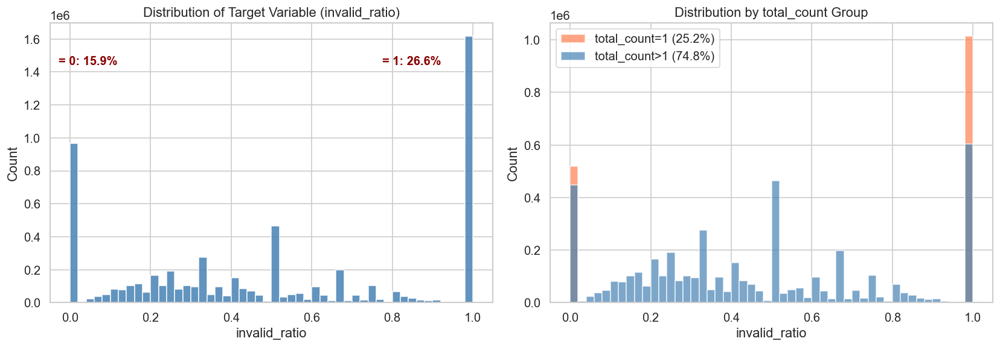
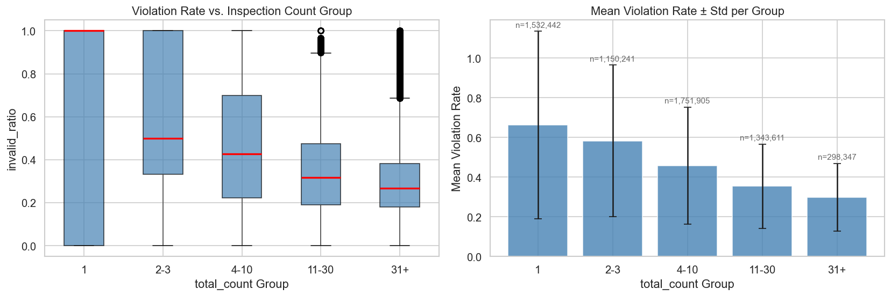
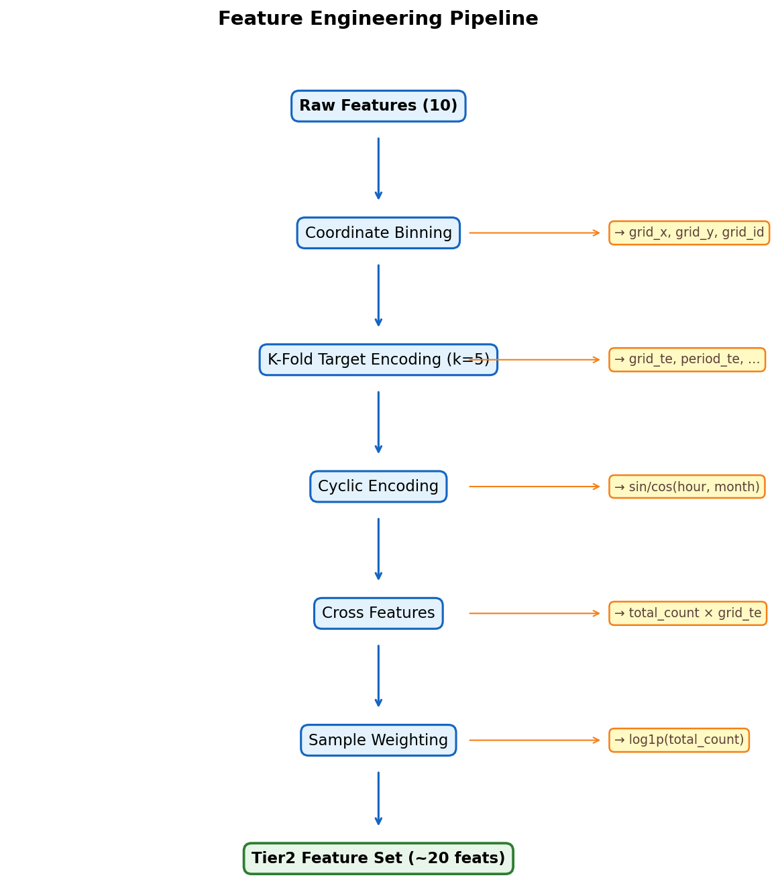
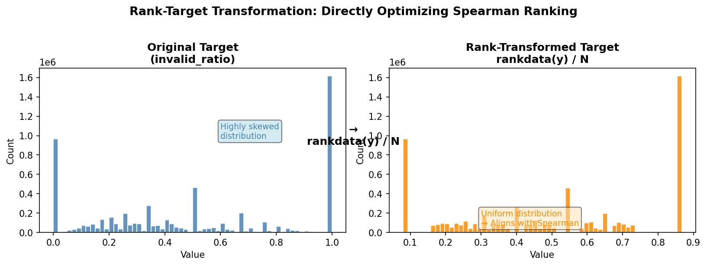
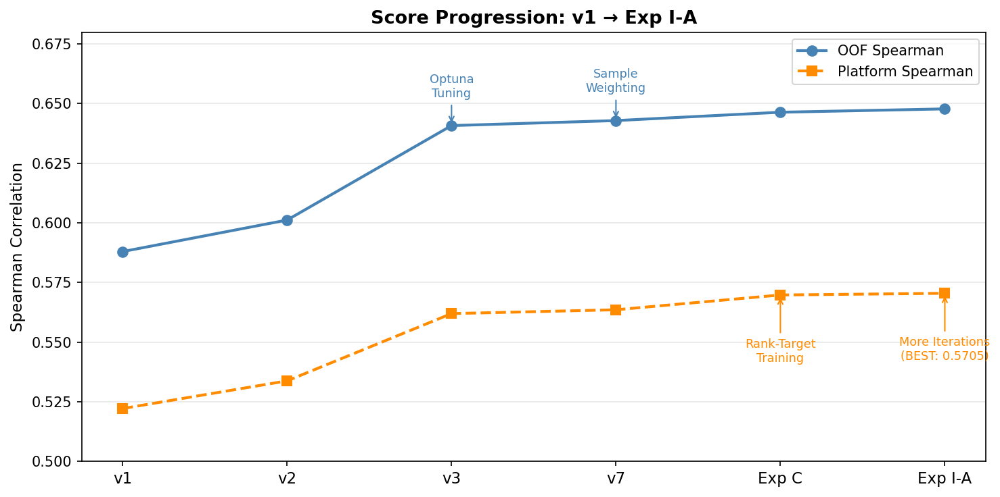
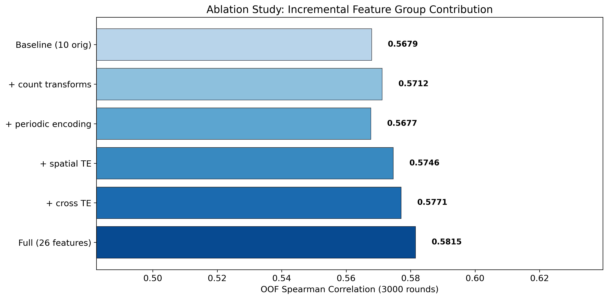
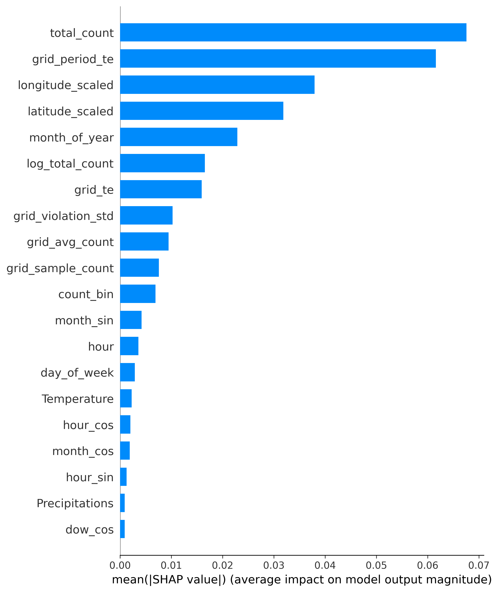
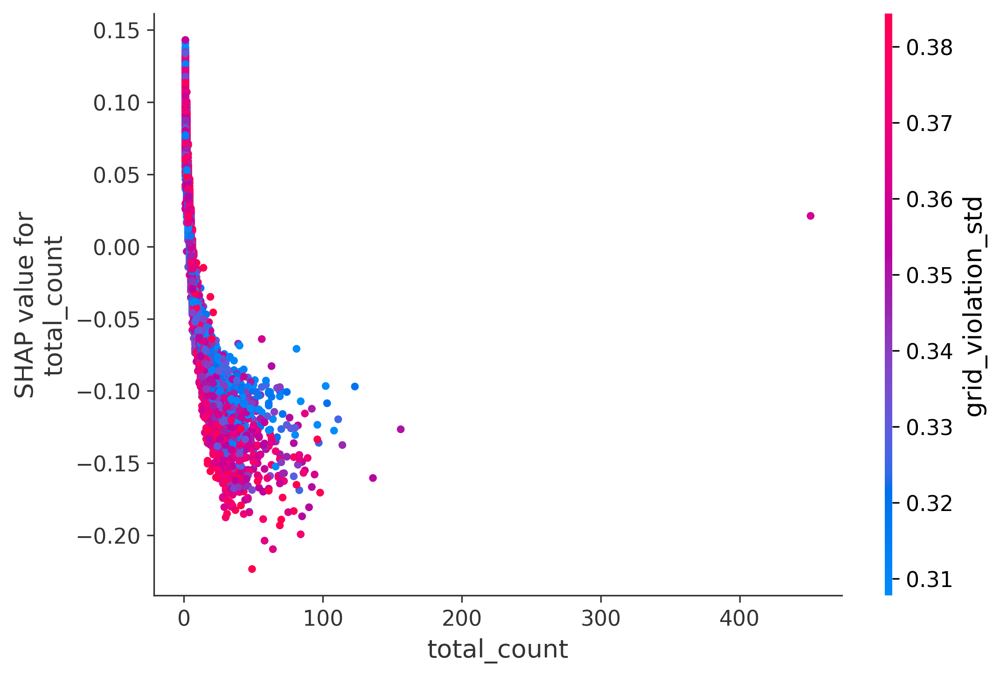
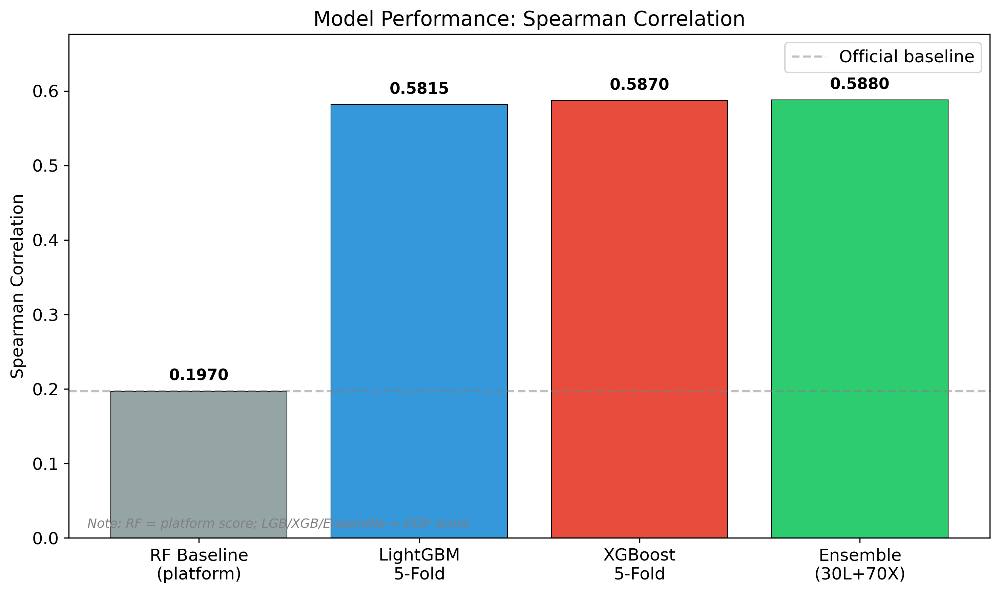
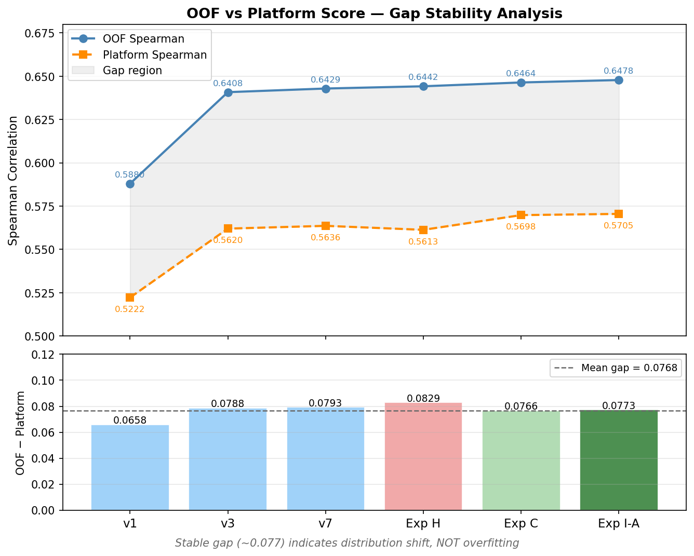

# Abstract

<!-- ~150 words. Write last, after all sections are complete. -->
<!-- Cover: problem, data, method, key result, main finding -->

This study addresses the problem of predicting parking violation rates across urban zones in Thessaloniki, Greece, using data from the THESi smart parking system (ChallengeData #163). The dataset comprises 6.07 million training observations with 10 raw features including GPS coordinates, weather conditions, and temporal indicators. We develop a gradient boosting framework combining LightGBM and XGBoost with systematic feature engineering (10 to 26 features via K-Fold Target Encoding and spatial-temporal transformations) and a novel rank-target training strategy that directly optimizes the Spearman evaluation metric. Our best ensemble achieves a Spearman correlation of 0.5705 on the competition platform, ranking 5th globally — a 190% improvement over the official Random Forest baseline of 0.197. We also document several negative results from distribution shift mitigation experiments, providing insights into the challenges of temporal covariate shift in urban prediction tasks.

# 1. Introduction

<!-- ~1.5 pages. Motivate the problem, state contributions. -->

## 1.1 Background and Motivation

<!-- Why parking violation prediction matters:
- Urban parking management is a growing challenge (cite Paper 4: Liu & Chen 2025)
- Illegal parking causes congestion, safety hazards, revenue loss
- Predictive models can help optimize enforcement patrol routes
- THESi system in Thessaloniki provides large-scale real-world data (cite Paper 1: Vo 2025)
-->

## 1.2 Problem Formulation

<!-- Define the prediction task clearly:
- Input: location (GPS), time (hour, day, month), weather (5 variables), observation count
- Output: invalid_ratio in [0,1] — fraction of invalid parking events
- Metric: Spearman rank correlation (rewards correct ordering, not numerical accuracy)
- Data scale: 6.07M train rows, 2.03M test rows
-->

## 1.3 Contributions

<!-- Bullet list of contributions:
1. Systematic feature engineering pipeline expanding 10 raw features to 26
2. Rank-target training strategy that directly optimizes Spearman correlation
3. Comprehensive ablation study and negative result analysis
4. Analysis of temporal distribution shift and its impact on model generalization
-->

# 2. Related Work

<!-- ~1.5 pages. Cover all 7 papers, organized by theme. -->

## 2.1 Parking Violation Prediction

<!-- Papers 1-2: Direct predecessors using the same THESi data source
- Vo (2025): 6-layer residual NN, sine encoding, Gaussian smoothing, MAE 0.146
- Karantaglis et al. (2022): Ablation study showing time features contribute most (10.2%)
- Key insight: both use deep learning; we show GBDT achieves competitive results with simpler models
-->

## 2.2 Spatiotemporal Analysis of Parking Violations

<!-- Papers 3-5: Domain context
- Gao et al. (2019): Multi-scale RF analysis in NYC, POI features, RF as strong baseline
- Liu & Chen (2025): MGTWM+GAT+ALSTM hybrid, commute/lunch peak patterns
- Sui et al. (2025): BYM model in NYC, SHAP interaction analysis, humidity > temperature
- Key insight: spatial encoding and temporal patterns are critical across all studies
-->

## 2.3 Gradient Boosting Methods

<!-- Papers 6-7: Model foundations
- Ke et al. (2017): LightGBM — GOSS, EFB, leaf-wise growth, efficient on large data
- Chen & Guestrin (2016): XGBoost — regularized objective, 2nd-order Taylor, sparse-aware
- Key insight: complementary strengths motivate our LGB+XGB ensemble
-->

# 3. Data Description

<!-- ~2 pages. Describe data, EDA findings, key challenges. -->

## 3.1 Dataset Overview

<!-- ChallengeData #163 by Egis
- Source: THESi roadside parking system, Thessaloniki, Greece
- Training set: 6,076,546 rows, 10 features
- Test set: 2,028,750 rows
- Target: invalid_ratio in [0, 1]
- Table: list all 10 features with types and descriptions
-->

## 3.2 Exploratory Data Analysis

<!-- Key EDA findings with figures:
- Fig 1: Target distribution — U-shaped, heavy mass at 0 and 1
- Fig 2: total_count vs violation rate — noise decreases with more observations
- Fig 4: Spearman correlation heatmap
- Fig 5: Spatial violation patterns
- Fig 6: Temporal patterns (hour, month)
-->

<!-- Fig 1: U-shaped distribution of invalid_ratio -->

<!-- Fig 2: Noise in low total_count samples -->

## 3.3 Key Data Challenges

<!-- Three critical challenges:
1. total_count=1 noise: 25% of samples have binary violation rates (0 or 1),
   Spearman only 0.41 for this subgroup vs 0.64 overall
2. Temporal distribution shift: test set contains only months 1-5,
   training set spans all 12 months (discovered via analysis)
3. U-shaped target distribution: 16% = 0, 27% = 1, complicating regression
-->

# 4. Methodology

<!-- ~3 pages. Feature engineering + model design + training strategy. -->

## 4.1 Feature Engineering Pipeline

<!-- 10 → 26 features, organized in tiers:

Tier 1 (basic transforms, 10 → 18 features):
- log1p(total_count), 1/total_count — capture nonlinear count effects
- Sine/cosine encoding for hour, day_of_week, month — preserve cyclicity (cite Paper 1)
- Grid discretization: 50×50 spatial grid from GPS coordinates

Tier 2 (target encoding, 18 → 26 features):
- K-Fold Target Encoding (K=5) to prevent leakage
- grid_te, period_te, grid_period_te, grid_hour_te, grid_month_te
- dow_period_te, grid_dow_te, weather_bin_te

Include figure: feature_engineering_pipeline.png
-->

## 4.2 Model Selection

<!-- Why LightGBM + XGBoost:
- GBDT advantages for this data: nonlinear interactions, mixed feature types,
  robust to irrelevant features, efficient on 6M rows
- Official baseline RF (0.197) confirms tree-based methods are appropriate
- LightGBM: GOSS sampling + leaf-wise growth, faster training (cite Paper 6)
- XGBoost: regularized objective + 2nd-order optimization, complementary (cite Paper 7)
- CatBoost tested but contributed weight=0 in ensemble (no diversity gain)
- Deep learning tested (MLP, ResNet, TabM): OOF ~0.42-0.44,
  far below GBDT's 0.64 — GBDT's inductive bias better suited to
  low-dimensional tabular data with engineered features

Peer feedback #2 response: justify GBDT over LR/SVM/RF
- LR/SVM: cannot capture nonlinear feature interactions
- RF: official baseline achieves only 0.197; GBDT with boosting captures residual patterns
-->

## 4.3 Training Strategy

### 4.3.1 Cross-Validation

<!-- 5-fold stratified CV, SEED=42
- OOF predictions aggregated across all folds
- Test predictions averaged across 5 fold models
-->

### 4.3.2 Rank-Target Training

<!-- Key innovation — directly optimizes Spearman:
- Standard training: predict raw invalid_ratio, hope ranking transfers
- Rank-target: train on rankdata(y)/N, model directly learns to rank
- Insight: "Spearman only cares about relative order" — align objective with metric
- Result: +0.0062 platform improvement (largest single gain)

Include figure: rank_target_diagram.png

Peer feedback #6 response: clarify this is 5-fold CV, not single experiment
-->

### 4.3.3 Sample Weighting

<!-- weight = log1p(total_count)
- Motivation: total_count=1 samples have binary violation rates (pure noise)
- log1p downweights noisy samples without discarding them
- Effect: OOF +0.0021 (v7 vs v3)
-->

### 4.3.4 Hyperparameter Optimization

<!-- Optuna with 50 trials per model
- Key hyperparameters: num_leaves, learning_rate, min_data_in_leaf,
  feature_fraction, lambda_l1, lambda_l2
- LGB: 20,000 iterations, LR 0.02
- XGB: 10,000 iterations, LR 0.03
-->

## 4.4 Ensemble

<!-- Weighted average: LGB × 0.35 + XGB × 0.65
- Weights found via grid search on OOF predictions (step=0.05)
- LGB-XGB prediction correlation: 0.965 (high, limiting diversity)
- CatBoost, TabM, NN all tested but added no ensemble gain
-->

# 5. Results

<!-- ~2.5 pages. Quantitative results, ablation, SHAP, negative results. -->

## 5.1 Overall Performance

<!-- Version progression table:
| Version | Key Change | OOF Spearman | Platform Score |
|---------|-----------|-------------|----------------|
| v1 | Baseline LGB+XGB | 0.5880 | 0.5222 |
| v3 | Optuna tuning | 0.6408 | 0.5620 |
| v7 | + sample weighting | 0.6429 | 0.5636 |
| Exp C | + rank-target | 0.6464 | 0.5698 |
| Exp I-A | + LGB 20K iter | 0.6478 | 0.5705 |

Include figure: score_progression.png
-->

## 5.2 Ablation Study

<!-- Feature group ablation:
- Baseline (raw features only) → + count transforms → + periodic encoding
  → + spatial TE → + cross TE → full 26 features
- Show incremental Spearman gains

Include figure: ablation_study.png
-->

## 5.3 Feature Importance and SHAP Analysis

<!-- SHAP analysis of top features:
- grid_period_te (rho=0.311): strongest predictor, spatial-temporal violation history
- grid_te (rho=0.307): spatial violation baseline
- total_count (rho=-0.295): observation volume, inversely related to noise

Caveat (peer feedback #4): feature importance reflects predictive contribution,
not causal influence. Target-encoded features are by construction correlated
with the outcome. Causal analysis would require controlled experiments.

Include figures: shap_bar.png, shap_dep_total_count.png
-->

## 5.4 Model Comparison: GBDT vs Deep Learning

<!-- Quantitative comparison:
| Model | OOF Spearman |
|-------|-------------|
| LightGBM | 0.6336 |
| XGBoost | 0.6310 |
| Ensemble | 0.6478 |
| TabM (DL) | 0.4402 |
| MLP/ResNet | ~0.42 |

Explanation: GBDT's inductive bias (axis-aligned splits, ensemble averaging)
is better suited to low-dimensional tabular data (26 features).
Neural networks excel with high-dimensional or unstructured data,
but cannot overcome the feature-space limitation here.

Peer feedback #3 & #7: frame carefully — this is about inductive bias fit,
not inherent GBDT robustness to distribution shift.

Include figure: model_comparison.png
-->

## 5.5 Negative Results

<!-- Important for scientific rigor (rubric: "appropriate methods and evaluation")

| Experiment | Method | Result | Takeaway |
|-----------|--------|--------|----------|
| v8a | M1-5 temporal TE | Platform -0.013 | Full-data TE is better |
| v9/v9a | Strong regularization | OOF -0.010 | Gap is not overfitting |
| v10 | DART boosting | OOF -0.019 | Dropout hurts on noisy data |
| v11 | Neural Networks | OOF 0.42 | NN too weak for ensemble |
| Exp D | Adversarial weighting | Platform -0.008 | AUC≈1.0 causes weight collapse |
| Exp H | Noise removal model | Platform -0.002 | Overfits noise boundary |

These negative results confirm that the OOF-Platform gap is caused by
TE distribution shift, not model overfitting — and cannot be closed by
stronger regularization or alternative architectures.
-->

# 6. Discussion

<!-- ~1.5 pages. Interpret results, limitations, peer feedback integration. -->

## 6.1 The OOF-Platform Gap

<!-- Gap analysis:
- OOF: 0.6478, Platform: 0.5705, Gap: 0.077
- Root cause: Target Encoding uses training-set statistics that differ between
  full 12-month training data and months 1-5 test data
- Adversarial Validation: AUC = 0.9999 confirms severe distribution shift
- Strong regularization did not close the gap → not overfitting

Include figure: oof_platform_gap.png or te_distribution_shift.png
-->

## 6.2 Why Rank-Target Training Works

<!-- Theoretical justification:
- Spearman = Pearson correlation of ranks → directly optimizing rank preserves ordering
- Removes scale sensitivity: model learns relative positions, not absolute values
- Empirical evidence: largest single-step improvement (+0.0062 platform)
- 5-fold CV provides robust estimate (not single experiment — peer feedback #6)

Limitation (peer feedback #5): rank-target is robust when relative ordering
transfers across distributions, but offers no protection when feature-target
relationships fundamentally reverse under extreme shift.
-->

## 6.3 Limitations

<!-- Key limitations:
1. Temporal distribution shift: test set = months 1-5 only, training = all 12 months.
   Standard K-fold CV treats data as i.i.d., which is reasonable for tabular data
   but a grouped time-split could provide more conservative OOF estimates.
   (peer feedback #1)

2. Ensemble diversity: LGB-XGB correlation 0.965 limits ensemble gains.
   With only 10 raw features, model diversity is inherently constrained.

3. Feature importance interpretation: SHAP values reflect predictive contribution,
   not causal mechanisms. Target-encoded features are correlated with the target
   by construction. (peer feedback #4)

4. GBDT and distribution shift: tree-based models rely on hard feature-space splits
   learned from training data. They are not inherently robust to covariate shift.
   Our OOF-Platform gap (0.077) demonstrates this. The advantage over DL here
   is inductive bias fit for low-dimensional tabular data, not shift robustness.
   (peer feedback #3)
-->

## 6.4 Lessons Learned

<!-- Practical insights:
- Aligning training objective with evaluation metric is the highest-leverage intervention
- Feature engineering plateaus quickly with limited raw features
- Negative results are as valuable as positive ones for understanding model behavior
- Distribution shift is the dominant challenge in real-world deployment
-->

# 7. Conclusion

<!-- ~0.5 page. Summarize contributions and main findings. -->

<!-- Key points to cover:
- Problem: parking violation rate prediction on 6M-row THESi dataset
- Method: LGB+XGB ensemble with rank-target training and systematic feature engineering
- Result: Spearman 0.5705 (platform), 190% improvement over baseline, rank #5
- Insight: rank-target training is the single most effective technique;
  distribution shift remains the primary challenge
- Future work: time-aware validation, richer spatial features (POI, road network),
  multi-seed evaluation for confidence intervals
-->

# References

<!-- Use numbered [1]-[7] style, consistent with in-text citations -->

[1] Vo, T. N. (2025). Deep Learning for On-Street Parking Violation Prediction. *arXiv:2505.06818*.

[2] Karantaglis, N., Passalis, N., & Tefas, A. (2022). Predicting On-Street Parking Violation Rate Using Deep Residual Neural Networks. *Pattern Recognition Letters*, 163, 82–91.

[3] Gao, S., Li, M., Liang, Y., Marks, J., Kang, Y., & Li, M. (2019). Predicting the Spatiotemporal Legality of On-Street Parking Using Open Data and Machine Learning. *Annals of GIS*, 25(4), 299–312.

[4] Liu, J., & Chen, X. (2025). Short-term Parking Violations Demand Dynamic Prediction Considering Spatiotemporal Heterogeneity. *Transportation*.

[5] Sui, Y., Feng, T., & Zhang, L. (2025). Spatio-temporal Heterogeneity in Street Illegal Parking: A Case Study in New York City. *Journal of Transport Geography*.

[6] Ke, G., Meng, Q., Finley, T., Wang, T., Chen, W., Ma, W., Ye, Q., & Liu, T.-Y. (2017). LightGBM: A Highly Efficient Gradient Boosting Decision Tree. *Advances in Neural Information Processing Systems*, 30.

[7] Chen, T., & Guestrin, C. (2016). XGBoost: A Scalable Tree Boosting System. *Proceedings of the 22nd ACM SIGKDD International Conference on Knowledge Discovery and Data Mining*, 785–794.

# Appendix A: Reproducibility

<!-- How to reproduce results:
- GitHub repository link
- environment.yml (conda env create -f environment.yml)
- Data download: ChallengeData #163
- Run notebooks 01-06 in order (Restart & Run All)
- GPU scripts in scripts/ are supplementary for long-running training
- Random seed: SEED = 42
-->

# Appendix B: Team Contribution

<!-- Fill in team member contributions
| Member | Contribution |
|--------|-------------|
| ... | ... |
-->
