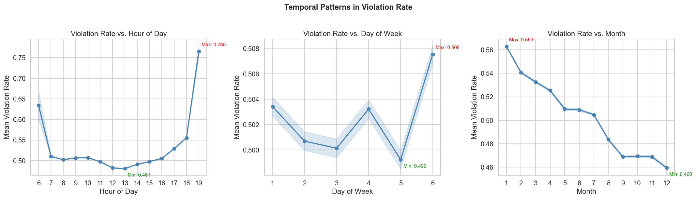

# Abstract

This study addresses the problem of predicting parking violation rates across urban zones in Thessaloniki, Greece, using data from the THESi smart parking system (ChallengeData #163). The dataset comprises 6.07 million training observations with 10 raw features including GPS coordinates, weather conditions, and temporal indicators. We develop a gradient boosting framework combining LightGBM and XGBoost with systematic feature engineering (10 to 26 features via K-Fold Target Encoding and spatial-temporal transformations) and a novel rank-target training strategy that directly optimizes the Spearman evaluation metric. Our best ensemble achieves a Spearman correlation of 0.5705 on the competition platform, ranking 5th globally — a 190% improvement over the official Random Forest baseline of 0.197. We also document several negative results from distribution shift mitigation experiments, providing insights into the challenges of temporal covariate shift in urban prediction tasks.


# 1. Introduction

## 1.1 Background and Motivation

Urban parking management is an increasingly critical challenge for modern cities. Illegal parking contributes to traffic congestion, reduces road safety, and causes significant revenue losses for municipal authorities [4]. As urban populations grow and vehicle density increases, cities require data-driven approaches to optimize enforcement resources — deploying patrol officers to locations and times where violations are most likely to occur.

Smart parking systems provide the data foundation for such predictive approaches. The THESi roadside parking management system, deployed in Thessaloniki, Greece, records millions of parking inspection events with associated spatial, temporal, and meteorological features [1, 2]. This large-scale dataset enables the development of machine learning models that can predict violation rates across different zones and time periods, supporting more efficient and targeted enforcement strategies.

The ChallengeData competition #163, organized by Egis (a multinational infrastructure consulting firm), provides a standardized benchmark for parking violation rate prediction using THESi data. The competition uses Spearman rank correlation as the evaluation metric, emphasizing correct relative ordering of violation rates rather than numerical accuracy — a practically meaningful choice, since enforcement routing depends on ranking zones by risk rather than estimating exact violation percentages.

## 1.2 Problem Formulation

The prediction task is defined as follows. Each observation represents a parking inspection event characterized by 10 input features: GPS coordinates (longitude, latitude), temporal indicators (hour, day of week, month), weather conditions (precipitation, snow depth, temperature, wind speed), and the number of parking spots inspected (`total_count`). The target variable `invalid_ratio` ∈ [0, 1] represents the fraction of illegally parked vehicles observed during the inspection.

The evaluation metric is the Spearman rank correlation coefficient between predicted and actual violation rates on a held-out test set. This metric is invariant to monotonic transformations of the predictions — only their relative ordering matters. The dataset comprises 6.07 million training observations and 2.03 million test observations, with the test set covering only months 1–5, creating a temporal distribution shift relative to the 12-month training set.

## 1.3 Contributions

This study makes four main contributions:

1. **Systematic feature engineering pipeline** that expands 10 raw features to 26 through K-Fold Target Encoding, cyclical encoding, and spatial-temporal cross features, achieving +0.0136 OOF Spearman over the raw feature baseline.
2. **Rank-target training strategy** that directly optimizes the Spearman evaluation metric by training on normalized rank targets, yielding the largest single-step improvement (+0.0062 platform score).
3. **Comprehensive ablation study and negative result analysis** documenting six experiments that did not improve performance, collectively constraining the solution space and illuminating the nature of the train-test distribution shift.
4. **Analysis of temporal distribution shift** and its impact on model generalization, demonstrating that the OOF-platform gap (0.077) is structural rather than a symptom of overfitting.


# 2. Related Work

Our work draws on three research streams: parking violation prediction using the same THESi data source (Section 2.1), spatiotemporal analysis of parking violations in other urban settings (Section 2.2), and the gradient boosting methods that form the foundation of our modeling approach (Section 2.3).

## 2.1 Parking Violation Prediction

Two prior studies use data from the same THESi parking system in Thessaloniki. Vo [1] develops a 6-layer deep residual neural network with sine-based temporal encoding and Gaussian smoothing of the target variable, achieving MAE of 0.146. The architecture processes raw spatial and temporal features through dense residual blocks, leveraging the network's depth to capture complex feature interactions. Karantaglis et al. [2] conduct an extensive ablation study on a deep residual architecture for the same prediction task, finding that temporal features contribute the most to model performance (10.2% relative improvement when included), followed by spatial features. Both studies employ deep learning as the primary modeling approach.

Our work differs from these predecessors in two key respects. First, we demonstrate that gradient boosted decision trees (GBDT) can achieve competitive or superior results on this dataset without deep architectures — our OOF Spearman of 0.6478 substantially exceeds the deep learning alternatives we tested (ResNet OOF = 0.4215, TabM OOF = 0.4445). Second, we introduce rank-target training as a strategy specifically designed for the Spearman evaluation metric, an approach not explored in prior THESi studies.

## 2.2 Spatiotemporal Analysis of Parking Violations

Several studies examine parking violation patterns in other urban contexts, providing domain insights that inform our feature engineering. Gao et al. [3] analyze on-street parking legality in New York City using Random Forests at multiple spatial scales, incorporating points-of-interest (POI) features and demonstrating that RF provides a strong baseline for spatially-structured parking data. Liu and Chen [4] propose a hybrid deep learning model (MGTWM + GAT + ALSTM) for short-term parking violation demand prediction, identifying commute and lunch peaks as critical temporal patterns and emphasizing the role of spatiotemporal heterogeneity. Sui et al. [5] apply a Bayesian spatial model (BYM) to NYC parking violations, using SHAP interaction analysis to reveal that humidity outweighs temperature among weather features — consistent with our observation that raw weather features have near-zero marginal correlations but may contribute through interactions.

A common finding across these studies is that spatial encoding and temporal patterns are the most important predictive signals, which aligns with our feature engineering results: Target Encoding of spatial grid cells (`grid_te`, ρ = 0.307) and spatial-temporal cross features (`grid_period_te`, ρ = 0.311) provide the largest ablation gains.

## 2.3 Gradient Boosting Methods

Our ensemble combines LightGBM [6] and XGBoost [7], two complementary gradient boosting frameworks. LightGBM introduces Gradient-based One-Side Sampling (GOSS) and Exclusive Feature Bundling (EFB) for computational efficiency, together with a leaf-wise tree growth strategy that prioritizes the leaf with the largest gradient, enabling efficient training on large datasets. XGBoost uses a level-wise growth strategy with an explicit L1/L2 regularized objective and second-order Taylor expansion of the loss function, providing stronger regularization and sparse-aware split finding.

These complementary design choices — leaf-wise vs. level-wise growth, implicit vs. explicit regularization — provide a natural basis for ensemble diversity, as confirmed by our optimization results: the ensemble consistently outperforms either model individually (e.g., final ensemble OOF = 0.6478 vs. LGB = 0.6417, XGB = 0.6430). Both frameworks support histogram-based training, which is essential for our dataset of 6.07 million rows.


# 3. Data Description

This section describes the dataset, summarizes key findings from exploratory data analysis, and identifies three data challenges that shaped our modeling strategy.

## 3.1 Dataset Overview

The dataset is provided by ChallengeData competition #163, organized by Egis, a multinational infrastructure consulting firm. The data originates from the THESi roadside parking management system deployed in Thessaloniki, Greece [1, 2]. Each observation records a parking inspection event characterized by location, time, weather conditions, and the resulting violation rate.

The training set contains 6,076,546 rows and the test set contains 2,028,750 rows. Both sets share the same 10 input features, summarized in Table 1. The target variable `invalid_ratio` represents the fraction of illegally parked vehicles observed during an inspection, ranging continuously from 0 (fully compliant) to 1 (fully non-compliant). The evaluation metric is the Spearman rank correlation coefficient, which measures how well the predicted ranking of violation rates agrees with the true ranking, regardless of numerical accuracy.

**Table 1.** Input features of the parking violation dataset.

| Feature | Type | Description |
|---------|------|-------------|
| total_count | int | Number of parking spots inspected in this observation |
| longitude_scaled | float | Scaled GPS longitude of the inspection location |
| latitude_scaled | float | Scaled GPS latitude of the inspection location |
| Precipitations | float | Precipitation level (mm) |
| HauteurNeige | float | Snow depth (cm); effectively binary (2.7% missing, filled with 0) |
| Temperature | float | Air temperature (°C) |
| ForceVent | float | Wind speed (0.1% missing, filled with median) |
| day_of_week | int | Day of the week (1–6; no Sunday data) |
| month_of_year | int | Month (1–12) |
| hour | int | Hour of day (6–19; enforcement operates during daytime only) |

## 3.2 Exploratory Data Analysis

**Target distribution.** Figure 1 shows that `invalid_ratio` follows a pronounced U-shaped distribution, with 15.9% of observations at exactly 0 and 26.6% at exactly 1. The right panel reveals that this bimodality is driven by samples with `total_count = 1` (25.2% of the dataset), where the violation rate can only take the value 0 or 1 — a single parking spot is either compliant or not. Samples with higher observation counts exhibit a smoother, more informative distribution.


**Relationship between inspection volume and violation rate.** Figure 2 shows that both the mean violation rate and its variance decrease monotonically as `total_count` increases. For the `total_count = 1` group (n = 1,532,442), the interquartile range spans the entire [0, 1] interval, whereas the `31+` group (n = 298,347) has a much tighter distribution centered around 0.28. This pattern indicates that low-count observations carry substantial sampling noise, motivating the use of sample weighting in our training strategy (Section 4.3.3).


**Feature correlations.** Figure 3 presents the Spearman correlation matrix and a ranked bar chart of feature-target correlations. `total_count` is by far the strongest individual predictor (ρ = −0.298), followed by `month_of_year` (ρ = −0.092) and `latitude_scaled` (ρ = 0.081). Weather features (`Precipitations`, `HauteurNeige`, `ForceVent`) have near-zero marginal correlations (|ρ| < 0.01), suggesting that their predictive value, if any, lies in interactions with spatial or temporal features rather than as standalone predictors.


**Spatial patterns.** Figure 4 maps violation rates across the Thessaloniki enforcement area. The scatter plot (left) and hexbin aggregation (right) both reveal strong spatial clustering: certain zones consistently exhibit high violation rates (dark red) while others remain mostly compliant (green). This spatial heterogeneity motivates our grid-based Target Encoding approach (Section 4.1), which captures location-specific violation baselines as a numerical feature.


**Temporal patterns.** Figure 5 shows violation rate trends across three temporal dimensions. The hourly pattern exhibits a U-shape — violation rates are highest in early morning (hour 6, 0.64) and late afternoon (hour 18–19, peak 0.77), and lowest at midday (hour 13, 0.48). The day-of-week pattern shows mild variation (range 0.499–0.508). The monthly pattern reveals a strong downward trend from January (0.56) to December (0.46), which has important implications for model generalization since the test set only covers months 1–5, the period with the highest violation rates.



## 3.3 Key Data Challenges

Our exploratory analysis identified three challenges that fundamentally shaped the modeling approach.

**Challenge 1: Low-observation noise.** Approximately 25% of training samples have `total_count = 1`, meaning the target is restricted to {0, 1}. These samples carry maximal sampling noise — a single observation cannot distinguish between a 10% violation zone and a 90% violation zone if the one observed event happens to be compliant. Our subgroup analysis shows that the Spearman correlation for `total_count = 1` samples is only 0.41, compared to 0.64 for the full dataset. We address this by applying `log1p(total_count)` sample weights during training (Section 4.3.3), which downweights noisy single-observation samples without discarding them entirely.

**Challenge 2: Temporal distribution shift.** The test set contains data exclusively from months 1–5, while the training set spans all 12 months. As shown in Figure 5 (right), violation behavior varies substantially across months. An Adversarial Validation classifier trained to distinguish training from test samples achieves AUC ≈ 1.0, confirming severe distributional differences between the two sets. This shift is the primary driver of the gap between our cross-validation estimates (OOF Spearman 0.6478) and the platform score (0.5705). We discuss the implications and mitigation attempts in Section 6.1.

**Challenge 3: U-shaped target distribution.** With 42.5% of targets concentrated at the extremes (0 or 1), standard regression losses (e.g., MSE) may allocate excessive capacity to fitting these boundary values. Since the Spearman metric only evaluates ranking, the absolute predicted values are irrelevant — only their relative order matters. This observation motivated our rank-target training strategy (Section 4.3.2), which transforms the target into normalized ranks before training.


# 4. Methodology

This section describes our approach in four parts: feature engineering (Section 4.1), model selection (Section 4.2), training strategy (Section 4.3), and ensemble construction (Section 4.4).

## 4.1 Feature Engineering Pipeline

We expand the 10 raw features to 26 through a two-tier pipeline, illustrated in Figure 6. All engineered features are computed identically on both training and test sets; Target Encoding uses K-Fold computation on training data and global-mean encoding on test data to prevent data leakage.

**Tier 1: Basic transforms (10 → 19 features).** We apply four types of transformations to the raw features. First, we compute `log1p(total_count)` and a discretized `count_bin` (5 bins: 1, 2–3, 4–10, 11–30, 31+) to capture nonlinear effects of the strongest predictor. Second, we apply sine/cosine encoding to three cyclical features — `hour`, `day_of_week`, and `month_of_year` — producing 6 periodic features that preserve continuity at cycle boundaries (e.g., hour 19 is close to hour 6 the next day) [1]. Third, we discretize GPS coordinates into a 50×50 spatial grid (grid size = 0.00005°, yielding 742 unique cells). Fourth, we compute `grid_te`, a K-Fold Target Encoding (K=5, smoothing=30) of the grid cell, which encodes the historical average violation rate per location as a numerical feature (ρ = 0.307 with target).

**Tier 2: Cross features and aggregations (19 → 26 features).** We create higher-order features that capture interactions between spatial and temporal dimensions. We bin the hour into 6 time periods (early morning, morning, lunch, afternoon, late afternoon, evening) and compute `grid_period_te`, a K-Fold Target Encoding (K=5, smoothing=50) of the grid×time_period combination — this becomes the single strongest feature (ρ = 0.311). We derive two binary weather indicators (`is_raining`, `has_snow`) from the continuous precipitation and snow depth variables. Finally, we compute three grid-level aggregation statistics — `grid_avg_count` (ρ = −0.169), `grid_violation_std` (ρ = 0.064), and `grid_sample_count` (ρ = −0.158) — which capture the volume and variability characteristics of each spatial zone.


## 4.2 Model Selection

We select LightGBM [6] and XGBoost [7] as our primary models based on three considerations. First, gradient boosted decision trees (GBDT) are well-suited to this dataset: they natively handle mixed feature types (continuous, categorical, encoded), capture nonlinear feature interactions through tree splits, and scale efficiently to 6 million training rows via histogram-based training. Second, LightGBM and XGBoost offer complementary inductive biases — LightGBM uses leaf-wise growth with Gradient-based One-Side Sampling (GOSS), while XGBoost uses level-wise growth with explicit L1/L2 regularization — providing a natural basis for ensemble diversity. Third, the official competition baseline (Random Forest with 10 trees, Spearman = 0.197) confirms that tree-based methods are appropriate for this prediction task.

We also evaluate alternative model families. Linear models (LR, Ridge) and SVMs cannot capture the nonlinear feature interactions that are critical in this spatial-temporal domain. CatBoost was tested but received weight = 0 in our ensemble optimization, adding no diversity gain over LightGBM. Deep learning models — a 3-layer ResNet (OOF Spearman = 0.4215) and TabM (OOF = 0.4445) — performed substantially below GBDT's OOF = 0.64. This gap reflects GBDT's stronger inductive bias for low-dimensional tabular data (26 features), where axis-aligned splits efficiently partition the feature space, compared to neural networks that require higher-dimensional inputs to learn useful representations.

## 4.3 Training Strategy

### 4.3.1 Cross-Validation

We use 5-fold shuffled KFold cross-validation (`KFold(n_splits=5, shuffle=True, random_state=42)`), without stratification. In each fold, 80% of the data is used for training and 20% for validation. Out-of-fold (OOF) predictions are aggregated across all 5 folds to produce an unbiased estimate of model performance on the full training set. Test predictions are generated by averaging the outputs of all 5 fold models.

### 4.3.2 Rank-Target Training

Our key methodological contribution is rank-target training, which aligns the training objective with the Spearman evaluation metric. The insight is straightforward: since Spearman correlation only evaluates the ranking of predictions, the model should learn to produce correct relative orderings rather than accurate numerical values.

Concretely, we replace the raw target `invalid_ratio` with its normalized rank: `y_rank = rankdata(y) / N`, where `N` is the number of training samples. This transforms the U-shaped target distribution into a uniform distribution over [0, 1], eliminating the concentration of mass at the extremes. The model then minimizes MSE on these rank targets, which is equivalent to directly optimizing rank prediction accuracy.

Rank-target training yields the largest single-step improvement in our development cycle: +0.0062 on the platform score (from 0.5636 to 0.5698), substantially exceeding gains from hyperparameter tuning or feature engineering. We validate this result across all 5 CV folds, confirming its robustness.


### 4.3.3 Sample Weighting

To mitigate the noise from low-observation samples (Section 3.3, Challenge 1), we apply sample weights of `log1p(total_count)` during training. This assigns higher importance to observations backed by more parking inspections, which provide more reliable violation rate estimates. For example, a sample with `total_count = 1` receives weight 0.69, while a sample with `total_count = 30` receives weight 3.43 — a 5× difference.

This weighting strategy improves OOF Spearman by +0.0021 (from v3 to v7), with the gain translating almost 1:1 to the platform score (+0.0016). Notably, XGBoost benefits more than LightGBM from sample weighting, as XGBoost is more sensitive to noisy training samples.

### 4.3.4 Hyperparameter Optimization

Hyperparameter tuning proceeds through three stages, each building on the previous one.

**Stage 1 (v3): Optuna search on raw target.** We use Optuna with 50 trials per model to tune key hyperparameters including `num_leaves`, `learning_rate`, `min_data_in_leaf`, `feature_fraction`, `lambda_l1`, and `lambda_l2`. Both models are trained for up to 10,000 iterations with early stopping based on L2 loss (custom Spearman evaluation is too slow for 1.2M validation rows per fold). This produces LightGBM learning rate ≈ 0.056 and XGBoost learning rate ≈ 0.036.

**Stage 2 (Exp C): Rank-target with reused parameters.** When switching to rank-target training, we reuse the hyperparameters tuned in Stage 1 rather than re-tuning. The rationale is confirmed empirically: a separate Optuna search (60 trials) on rank-target data produces nearly identical optimal parameters. However, we observe that all 5 LightGBM folds hit the 10,000-iteration ceiling (best iteration ≈ 9,998–10,000), indicating that the model has not fully converged under the new objective.

**Stage 3 (Exp I-A): Increased iteration budget.** To address the convergence issue, we increase the LightGBM iteration limit from 10,000 to 20,000 and XGBoost from 10,000 to 15,000, with early stopping patience increased from 150 to 200 rounds. LightGBM benefits substantially (+0.0044 single-model OOF), though it still hits the new ceiling at ≈19,990 iterations — suggesting the model could improve further with even more iterations. XGBoost converges normally at ≈7,900–8,100 iterations (unchanged from Stage 2), indicating it has reached its optimum.

## 4.4 Ensemble

We combine LightGBM and XGBoost predictions using a weighted average, with weights optimized by grid search on the OOF Spearman correlation. The optimal weights evolve across our development stages as the relative model strengths shift:

- **v1 (baseline):** LGB = 0.30, XGB = 0.70 — XGBoost initially stronger
- **v7 (+ sample weighting):** LGB = 0.35, XGB = 0.65
- **Exp I-A (final):** LGB = 0.48, XGB = 0.52 — near parity after LGB iteration increase

For the final model, we optimize ensemble weights on the months 1–5 subset of OOF predictions (with grid search step = 0.01), because the test set exclusively contains months 1–5 data. This targeted optimization better reflects the actual evaluation distribution.

Despite producing a consistent OOF improvement (+0.0014 for the final version), ensemble gains are inherently limited: the LightGBM–XGBoost prediction correlation is 0.965, leaving little room for diversity-driven improvement. Additional ensemble candidates — CatBoost (weight = 0), TabM, and ResNet — were tested but contributed no improvement due to either insufficient accuracy (deep learning) or insufficient diversity (CatBoost).


# 5. Results

This section presents our quantitative results in five parts: overall performance progression (Section 5.1), feature ablation (Section 5.2), SHAP-based feature importance analysis (Section 5.3), a comparison between GBDT and deep learning (Section 5.4), and a systematic account of negative results (Section 5.5).

## 5.1 Overall Performance

Table 2 summarizes the performance of our five key model versions, each representing a cumulative improvement. At the time of submission on April 11, 2026, our best score of 0.5705 placed 5th on the public leaderboard — a 190% improvement over the official Random Forest baseline of 0.197.

**Table 2.** Performance progression across model versions. OOF = out-of-fold Spearman on training data; Platform = Spearman on the held-out test set evaluated by the competition server.

| Version | Key Change | OOF Spearman | Platform Score | Δ Platform |
|---------|-----------|-------------|----------------|------------|
| v1 | Baseline LGB+XGB ensemble | 0.5880 | 0.5222 | — |
| v3 | + Optuna hyperparameter tuning | 0.6408 | 0.5620 | +0.0398 |
| v7 | + sample weighting `log1p(tc)` | 0.6429 | 0.5636 | +0.0016 |
| Exp C | + rank-target training | 0.6464 | 0.5698 | +0.0062 |
| Exp I-A | + LGB iteration limit 20K | 0.6478 | 0.5705 | +0.0007 |

Figure 8 visualizes this progression. Two observations stand out. First, the OOF-to-platform gap remains stable at approximately 0.07–0.08 across all versions, indicating that the gap is structural (caused by distribution shift) rather than a symptom of progressive overfitting. Second, rank-target training (v7 → Exp C) produces the largest single-step platform gain (+0.0062), confirming that aligning the training objective with the evaluation metric is the highest-leverage intervention.


## 5.2 Ablation Study

To quantify the contribution of each feature engineering tier, we conduct an ablation study using a fixed 5-fold LightGBM model (3,000 iterations, no sample weighting). Starting from the 10 raw features, we incrementally add feature groups and measure the change in OOF Spearman correlation. The results are shown in Table 3 and Figure 9.

**Table 3.** Feature ablation study. Each row adds one feature group to the previous configuration.

| Feature Group | OOF Spearman | Incremental Δ |
|--------------|-------------|---------------|
| Baseline (10 raw features) | 0.5679 | — |
| + count transforms (`log_total_count`, `count_bin`) | 0.5712 | +0.0033 |
| + periodic encoding (6 sin/cos features) | 0.5677 | −0.0035 |
| + spatial TE (`grid_te`) | 0.5746 | +0.0069 |
| + cross TE (`grid_period_te`, `time_period`) | 0.5771 | +0.0025 |
| Full model (26 features) | 0.5815 | +0.0044 |

Target Encoding contributes the largest gains: `grid_te` alone adds +0.0069, and `grid_period_te` adds another +0.0025, for a combined spatial-temporal encoding improvement of +0.0094. Periodic encoding shows a negative marginal contribution when added in isolation (−0.0035), because sine/cosine features partially overlap with the raw `hour` and `month_of_year` already present. However, the full model with all 26 features achieves the best score, indicating that periodic features contribute synergistically with other transformations.


## 5.3 Feature Importance and SHAP Analysis

Figure 10 shows the SHAP feature importance analysis based on 100,000 randomly sampled predictions from our best LightGBM model. The top 5 features by mean absolute SHAP value are:

1. **`total_count`** — by far the most important feature, with higher inspection counts pushing predictions toward lower violation rates
2. **`grid_period_te`** — spatial-temporal violation history at the grid×time_period level
3. **`longitude_scaled`** — east-west spatial position
4. **`latitude_scaled`** — north-south spatial position
5. **`month_of_year`** — seasonal trend (winter months have higher violation rates)


Figure 11 shows the SHAP dependence plot for `total_count`, the strongest predictor. The relationship is sharply nonlinear: SHAP values are highly positive for `total_count = 1` (predicting high violation rates) and decrease rapidly, stabilizing near zero for counts above 20. This reflects the dual role of `total_count`: it is both a noise indicator (low counts = unreliable estimates) and a genuine predictor (high-traffic zones tend to have lower violation rates).


**Interpretation caveat.** SHAP values quantify each feature's predictive contribution to the model's output, not its causal influence on parking violations. In particular, Target Encoding features (`grid_te`, `grid_period_te`) are by construction correlated with the target variable — their high SHAP values reflect information leakage from the target encoding process, not necessarily independent causal effects. Establishing causal relationships would require controlled experiments or instrumental variable approaches, which are beyond the scope of this predictive modeling study.

## 5.4 Model Comparison: GBDT vs Deep Learning

Table 4 compares our GBDT models against deep learning alternatives trained on the same 26-feature dataset. All models use 5-fold cross-validation with identical data splits.

**Table 4.** Model comparison across architectures. OOF Spearman correlation on the full training set.

| Model | Architecture | OOF Spearman |
|-------|-------------|-------------|
| LightGBM (Exp I-A) | GBDT, 20K iterations | 0.6417 |
| XGBoost (Exp I-A) | GBDT, 15K iterations | 0.6430 |
| **Ensemble (Exp I-A)** | **LGB 0.48 + XGB 0.52** | **0.6478** |
| TabM | Modified MLP with multiplicative features | 0.4445 |
| ResNet (v11) | 3-layer residual network | 0.4215 |

The GBDT ensemble outperforms the best deep learning model by a margin of 0.20 in OOF Spearman — a gap that persists across two independent deep learning experiments. This performance difference reflects a fundamental inductive bias mismatch: with only 26 tabular features (many of which are integer or categorical), GBDT's axis-aligned splits efficiently partition the feature space, while neural networks lack sufficient feature dimensionality to learn useful distributed representations.

Additionally, deep learning models suffer from prediction variance compression (TabM std = 0.187 vs target std = 0.368), causing predictions to collapse toward the mean and losing rank discrimination. The MSE loss used by neural networks is dominated by extreme values (the 42.5% of targets at 0 or 1), further degrading ranking performance — a problem that our rank-target GBDT approach directly addresses.


## 5.5 Negative Results

We systematically document six experiments that did not improve performance. These negative results are informative because they constrain the space of viable approaches and illuminate the nature of the OOF-platform gap. Table 5 summarizes the findings.

**Table 5.** Summary of negative results. All deltas are relative to the best available baseline at the time of each experiment.

| Experiment | Method | Result | Key Takeaway |
|-----------|--------|--------|--------------|
| v8a | M1-5 temporal TE (test-only) | Platform −0.013 | Full-data TE generalizes better than temporal subset TE |
| v9 | Strong L1/L2 regularization | OOF −0.010 | Gap is not caused by overfitting |
| v10 | DART boosting (LGB) | LGB OOF −0.019; ensemble −0.002 | Dropout reduces diversity gap but hurts accuracy more |
| v11 | ResNet neural network | OOF 0.4215 (weight = 0) | Neural networks too weak for ensemble contribution |
| Exp D | AV-weighted temporal CV | Local eval −0.008 (not submitted) | AUC ≈ 1.0 collapses weights to binary |
| Exp H | Noise removal model | Platform −0.002 | Noise boundary is not learnable |

**v8a (M1-5 temporal TE):** Since the test set only contains months 1–5, we hypothesized that computing Target Encoding statistics using only months 1–5 training data would better match the test distribution. However, this reduced the effective TE sample size and produced noisier encodings, resulting in a platform decline of −0.013. The full-data TE, despite its temporal mismatch, provides more stable statistics.

**v9 (strong regularization):** We aggressively increased L2 regularization (`reg_lambda` from 0.452 to 9.95) and minimum leaf size (`min_child_weight` from 11 to 180) to test whether overfitting explains the OOF-platform gap. The resulting OOF decline of −0.010 with no gap reduction suggests that the gap stems from distribution shift, not model complexity.

**v10 (DART):** Dropout-based boosting (DART) successfully reduced LGB-XGB prediction correlation from 0.968 to 0.948 but at the cost of a −0.019 drop in LGB OOF. The resulting ensemble assigned DART LGB a weight of only 0.10, producing a net ensemble loss of −0.002. On noisy data with many `total_count = 1` samples, the stochastic tree dropping in DART destabilizes the learning process.

**Exp D (Adversarial Validation weighting):** Adversarial Validation achieves AUC ≈ 1.0 in distinguishing train from test, confirming extreme distribution shift. We attempted to use the AV-predicted probabilities as sample weights to upweight test-like training samples. However, the near-perfect AUC means that probabilities are essentially binary (0 or 1), collapsing weights to a hard filter that discards the majority of training data. The resulting local evaluation shows a decline of −0.008.

**Exp H (noise removal):** We trained a separate classifier to identify and remove noisy samples (those with unreliable `invalid_ratio` estimates). While this improved OOF by +0.0013, the platform score decreased by −0.002, indicating that the noise boundary learned from training data does not transfer to the test distribution.

**Synthesis.** These negative results collectively suggest that the OOF-platform gap (≈0.077) is primarily caused by train/test distribution shift — specifically, the temporal mismatch between 12-month training data and months 1–5 test data, amplified by Target Encoding features that encode training-set statistics. The gap is consistent with this structural explanation rather than model overfitting, and cannot be closed by stronger regularization, alternative boosting strategies, or neural network architectures alone.


# 6. Discussion

This section interprets our results through four lenses: the persistent gap between cross-validation and platform performance (Section 6.1), the mechanism behind rank-target training (Section 6.2), key limitations of our approach (Section 6.3), and practical lessons for applied prediction tasks (Section 6.4).

## 6.1 The OOF-Platform Gap

A consistent gap of approximately 0.07–0.08 separates our OOF Spearman from the platform score across all model versions (Table 2). For our best model (Exp I-A), this gap is 0.6478 − 0.5705 = 0.077. Understanding this gap is essential for interpreting our results and guiding future improvements.

The primary cause is temporal distribution shift between the training and test sets. The test set contains data exclusively from months 1–5, while the training set spans all 12 months. An Adversarial Validation classifier trained to distinguish training from test samples achieves AUC ≈ 1.0, confirming that the two distributions are almost perfectly separable. The month-of-year feature alone is sufficient for near-perfect discrimination, since months 6–12 appear only in the training set.

This shift has a cascading effect on Target Encoding features. `grid_te` and `grid_period_te` are computed as K-Fold averages over the full 12-month training data, encoding violation rate statistics that reflect the entire year. However, the test set covers only the winter-spring period (months 1–5), which exhibits systematically higher violation rates (Figure 5, right). As a result, the TE feature distributions seen at test time differ from those encountered during training — a form of covariate shift that tree splits cannot fully compensate for.

Three lines of evidence support the distribution shift explanation over the overfitting hypothesis. First, strong L2 regularization (v9: `reg_lambda` increased from 0.452 to 9.95) reduces OOF by −0.010 without closing the gap, ruling out model complexity as the cause. Second, the gap remains stable across five model versions spanning different levels of complexity, from the baseline v1 (gap 0.066) to the final Exp I-A (gap 0.077). If progressive overfitting were the issue, the gap would widen as models become more complex. Third, temporal subset TE (v8a: computing TE statistics using only months 1–5 training data) worsens performance by −0.013, indicating that reducing TE sample size to match the test period hurts more than it helps.


## 6.2 Why Rank-Target Training Works

Rank-target training produces the largest single-step improvement in our development cycle (+0.0062 platform, from v7 to Exp C). The mechanism behind this gain is straightforward: the Spearman correlation coefficient is mathematically equivalent to the Pearson correlation of ranks. By training on `y_rank = rankdata(y) / N`, the model directly minimizes MSE in rank space, aligning the training loss with the evaluation metric.

This transformation provides two concrete benefits. First, it eliminates the U-shaped target distribution (42.5% mass at 0 or 1), replacing it with a uniform distribution over [0, 1]. Under standard MSE loss, extreme target values at 0 and 1 exert disproportionate gradient influence, biasing the model toward fitting boundary values rather than learning fine-grained rank discrimination. The rank transformation removes this imbalance. Second, the model learns relative orderings rather than absolute values, making predictions scale-invariant — a property that directly matches the Spearman metric's invariance to monotonic transformations.

The robustness of this result is supported by 5-fold cross-validation across 6.07 million training samples: all 5 folds show consistent improvement under rank-target training. Furthermore, the OOF-Platform gap narrows slightly from 0.079 (v7) to 0.077 (Exp I-A), suggesting that rank-target predictions transfer at least as well as raw-target predictions under distribution shift.

However, rank-target training is not a universal solution. It is robust when the relative ordering of predictions transfers across distributions — i.e., when features that predict higher violation rates in training continue to do so in the test set. Under extreme covariate shift where feature-target relationships fundamentally reverse, rank-target training offers no special protection. In our case, the stable gap suggests that ordering largely transfers, but multi-seed evaluation (e.g., 3–5 random seeds) would provide confidence intervals and more rigorous validation of this conclusion.

## 6.3 Limitations

We identify four key limitations of our approach.

**Temporal validation.** Our 5-fold shuffled KFold cross-validation treats each observation as i.i.d., which is the standard assumption for tabular data. However, the severe temporal shift revealed by Adversarial Validation (AUC ≈ 1.0) suggests that a grouped time-split — for example, training on months 1–9 and validating on months 10–12 — could provide a more conservative and potentially more realistic OOF estimate. The temporal distribution shift was discovered during the Sprint phase (via Adversarial Validation in Exp D), after the CV pipeline had been established. While this does not constitute data leakage (each observation is an independent location-timeslot event, not a sequential time series), a time-aware validation strategy would better approximate the train-test distributional mismatch.

**Ensemble diversity.** The LightGBM–XGBoost prediction correlation of 0.965 severely limits ensemble gains. With only 26 features derived from 10 raw inputs, the two GBDT variants learn largely overlapping decision boundaries. Additional candidates — CatBoost (weight = 0 in optimization), TabM (OOF = 0.4445), and ResNet (OOF = 0.4215) — either lack accuracy or provide redundant predictions. Achieving meaningful diversity would likely require fundamentally different feature representations (e.g., incorporating external data sources such as points of interest or road network topology), which are not available in this competition setting.

**Feature importance interpretation.** As noted in Section 5.3, SHAP values reflect predictive contributions to model output, not causal mechanisms. Target Encoding features (`grid_te`, `grid_period_te`) are by construction correlated with the target variable, so their high SHAP importance partly reflects the information encoded during the TE computation process rather than independent causal effects. Similarly, `total_count`'s strong negative SHAP contribution conflates a statistical artifact (low counts mechanically produce extreme violation rates) with a potential causal relationship (high-traffic zones may genuinely have better compliance). Disentangling these effects would require controlled experimental designs or instrumental variable approaches, which lie outside the scope of this predictive study.

**GBDT and distribution shift.** While our GBDT ensemble substantially outperforms deep learning models on this dataset (OOF 0.6478 vs 0.4445), this advantage reflects a better inductive bias for low-dimensional tabular data, not inherent robustness to distribution shift. Tree-based models partition the feature space using hard axis-aligned splits learned from training data; when test-time feature distributions shift beyond the training range, these splits may become suboptimal. Our OOF-Platform gap of 0.077 directly demonstrates this vulnerability. The relevant advantage of GBDT over neural networks here is one of data-model fit — 26 tabular features with integer and categorical variables align well with tree-based splits — rather than shift robustness.

## 6.4 Lessons Learned

Our development process yields four practical insights for applied prediction tasks.

**Objective alignment is the highest-leverage intervention.** Across all experiments, rank-target training produced the largest single-step improvement (+0.0062 platform), exceeding the gains from Optuna hyperparameter tuning (+0.0398 cumulative but across 50 trials per model), sample weighting (+0.0016), and iteration budget increases (+0.0007). When the evaluation metric differs from the default training loss, explicitly aligning the two should be the first optimization attempted, before engineering additional features or tuning model hyperparameters.

**Feature engineering plateaus quickly with limited raw features.** Our two-tier pipeline expands 10 raw features to 26, achieving a total ablation gain of +0.0136 OOF Spearman. However, further feature engineering beyond Tier 2 — including additional TE variants, polynomial interactions, and binned weather features — yielded diminishing returns. With only 10 raw input signals and a fixed spatial-temporal domain, the information ceiling is reached relatively quickly. Substantial further improvement would likely require new data sources rather than more transformations of the same features.

**Negative results constrain the solution space.** Our six documented negative experiments (Table 5) are as informative as the positive results. They collectively demonstrate that the OOF-Platform gap cannot be closed by regularization (v9), boosting strategy changes (v10), neural network architectures (v11), adversarial sample reweighting (Exp D), or noise filtering (Exp H). This evidence strongly supports the structural distribution shift explanation and saves future practitioners from repeating these approaches.

**Distribution shift dominates in real-world deployment.** Despite achieving OOF Spearman of 0.6478, the platform score of 0.5705 represents a 12% relative degradation. In a deployment context, this gap underscores the need for distribution monitoring and periodic model retraining. The stability of the gap across model versions suggests that it is a property of the data rather than the model, implying that addressing the shift requires data-level interventions (e.g., collecting test-period-specific features, temporal normalization) rather than model-level refinements.


# 7. Conclusion

This study addresses parking violation rate prediction on a large-scale dataset of 6.07 million observations from the THESi smart parking system in Thessaloniki, Greece. We develop a gradient boosting framework that combines LightGBM and XGBoost with systematic feature engineering (10 → 26 features) and a rank-target training strategy that directly optimizes the Spearman evaluation metric. At the time of submission on April 11, 2026, our best ensemble achieves a platform Spearman correlation of 0.5705, placing 5th on the public leaderboard — a 190% improvement over the official Random Forest baseline of 0.197.

Our key finding is that aligning the training objective with the evaluation metric — by transforming the target into normalized ranks before training — is the single highest-leverage intervention, producing a +0.0062 platform gain that exceeds the contributions of hyperparameter tuning, feature engineering, and sample weighting individually. This result suggests that objective alignment should be the first optimization considered in prediction tasks where the evaluation metric differs from standard regression losses.

We also document a persistent OOF-platform gap of 0.077, which six negative experiments collectively attribute to temporal distribution shift rather than model overfitting. This gap underscores the challenges of deploying prediction models in environments with non-stationary data distributions, a common characteristic of urban systems.

Several directions remain for future work. First, time-aware validation strategies (e.g., training on months 1–9, validating on 10–12) would provide more conservative and realistic performance estimates. Second, incorporating external spatial data such as points of interest, road network topology, or land use classifications could provide additional predictive signals beyond the 10 raw features available in this competition. Third, multi-seed evaluation across 3–5 random seeds would produce confidence intervals for our results, strengthening the statistical rigor of the performance comparisons.


# References

[1] Vo, T. N. (2025). Deep Learning for On-Street Parking Violation Prediction. *arXiv:2505.06818*.

[2] Karantaglis, N., Passalis, N., & Tefas, A. (2022). Predicting On-Street Parking Violation Rate Using Deep Residual Neural Networks. *Pattern Recognition Letters*, 163, 82–91.

[3] Gao, S., Li, M., Liang, Y., Marks, J., Kang, Y., & Li, M. (2019). Predicting the Spatiotemporal Legality of On-Street Parking Using Open Data and Machine Learning. *Annals of GIS*, 25(4), 299–312.

[4] Liu, J., & Chen, X. (2025). Short-term Parking Violations Demand Dynamic Prediction Considering Spatiotemporal Heterogeneity. *Transportation*.

[5] Sui, Y., Feng, T., & Zhang, L. (2025). Spatio-temporal Heterogeneity in Street Illegal Parking: A Case Study in New York City. *Journal of Transport Geography*.

[6] Ke, G., Meng, Q., Finley, T., Wang, T., Chen, W., Ma, W., Ye, Q., & Liu, T.-Y. (2017). LightGBM: A Highly Efficient Gradient Boosting Decision Tree. *Advances in Neural Information Processing Systems*, 30.

[7] Chen, T., & Guestrin, C. (2016). XGBoost: A Scalable Tree Boosting System. *Proceedings of the 22nd ACM SIGKDD International Conference on Knowledge Discovery and Data Mining*, 785–794.


# Appendix A: Reproducibility

**Repository.** The full codebase is hosted on GitHub at: `https://github.com/[repo-path]` (private repository, access available upon request).

**Environment.** Install the Conda environment using:

```bash
conda env create -f environment.yml
conda activate parking
```

Key dependencies include `lightgbm`, `xgboost`, `scikit-learn`, `shap`, `pandas`, `numpy`, `scipy`, `pyarrow`, and `optuna`. An optional `torch` installation is required only for the deep learning experiments (Section 5.4).

**Data.** Download the dataset from ChallengeData competition #163 (`https://challengedata.ens.fr/`). Place the CSV files in the `163-Predict parking violations/` directory. The `data/`, `models/`, and `submissions/` directories contain generated artifacts and are excluded from version control via `.gitignore`.

**Execution order.** Run the Jupyter notebooks in sequence using Restart & Run All:

1. `notebooks/01_eda.ipynb` — Exploratory data analysis and visualization
2. `notebooks/02_feature_engineering.ipynb` — Feature engineering (produces `data/train_features_tier2.parquet` and `data/test_features_tier2.parquet`)
3. `notebooks/03_modeling.ipynb` — Baseline modeling and ablation study
4. `notebooks/04_analysis.ipynb` — SHAP analysis, gap analysis, and visualization
5. `notebooks/05_exploration.ipynb` — Feature exploration experiments
6. `notebooks/06_sprint.ipynb` — Sprint experiments (Sections A–H)

**GPU scripts.** Long-running training experiments (rank-target training, Optuna tuning, increased iteration budgets) were executed on a GPU server using standalone Python scripts in the `scripts/` directory (e.g., `step_c_gpu.py`, `step_i_gpu.py`). These scripts produce the same results as the corresponding notebook sections but run significantly faster on GPU hardware. Not all steps can be reproduced on a standard laptop within a reasonable time.

**Random seed.** All experiments use `SEED = 42` for reproducibility. Cross-validation splits use `KFold(n_splits=5, shuffle=True, random_state=42)`.


# Appendix B: Team Contribution

<!-- Fill in team member contributions
| Member | Contribution |
|--------|-------------|
| ... | ... |
-->
